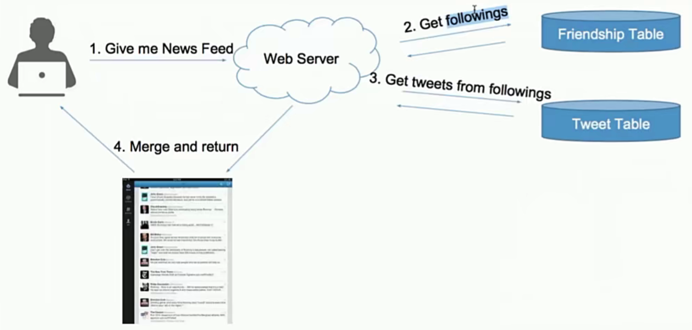
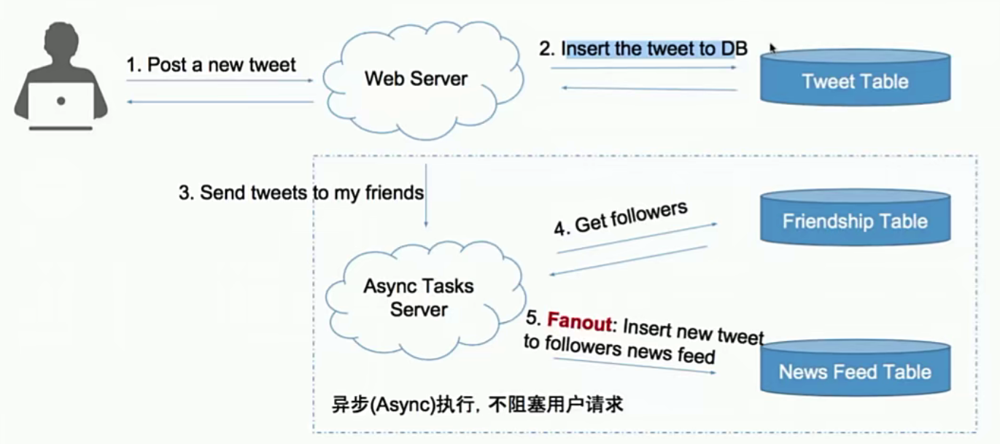

#### Table of Content 

# 0. 如何设计系统 How to design the System

### 1. 4S Analysis
- Scenario 场景
  - ask/features/qps/dau/interfaces
  - 需要设计哪些功能
    - step1: enumerate 罗列所有app的功能
      - register/login
      - user profile display / edit
      - upload image / video * 
      - search * 
      - post / share a tweet 
      - timeline / news feed
      - follow / unfollow a user
    - step 2: sort 选出核心功能
      - post a tweet
      - timeline
      - news feed
      - follow / unfollow a user
      - register / login
  - 需要承受多大的访问量？
    - 并发用户concurrent 
      - 日活跃*每个用户平均请求次数/一天多少秒user eg. 150M * 60 / 86400 ~ 100k
      - 峰值 peak = average concurrent user * 3 ～ 300 k
      - 快速增长的产品 fast growing
        - max peak users in 3 months = peak users * 2
    - 读频率 read qps(queries per second) eg.300 k
    - 写频率 write qps eg.5k
  - QPS 分析
    - qps = 100: 你用的笔记本做web 服务器就够了
    - qps = 1k： 用一台好点的web服务器，需要考虑single point failure
    - qps = 1m： 需要建设1000台web服务器的集群，考虑如何maintainance
    - 一台web server约承受1k的qps
    - 一台sql database约承受1k的qps
    - 一台nosql database 如cassandra 约承受量是10k的qps
    - 一台nosql database 如memcached 约承受量1m的qps
- Service 服务
  - 大系统如何拆分成小系统
    - step1: replay重放需求
    - step2: merge归并需求
  - split/application/module
- Storage 存储
  - 数据如何存储与访问
    - step 1. select为每个service选择存储结构
    - step 2. schema细化表结构
  - 数据库类型
    - 关系数据库 sql database eg. 用户信息
    - 非关系数据库 nosql database eg.推文 社交图谱
    - 文件系统 file system eg.图片 视频
  - schema/data/sql/nosql/file system
- Scale 升级
  - 解决缺陷，处理可能遇到的问题
  - sharding/optimizing/special case
  - 如何优化系统
    - step1: optimize
      - 解决设计缺陷 solve problems
        - pull vs push， normalize vs de-normalize
      - 更多功能设计 more features
        - edit，delete，media， ads
      - 一些特殊用例 special cases
        - lady gaga，inactive users
    - step2：maintenance
      - 鲁棒性：robust
        - 如果有一台服务器/数据挂了怎么办
      - 扩展性 scalabiliy  
        - 如果有流量暴增，如何扩展

# 1. 新鲜事系统 New Feeds System

- Example:  RSS reader， 朋友圈， twitter， facebook， twitter
- 核心： 关注与被关注，每个人看到的新鲜事都是不同的
- pattern1: storage - Pull Model
  
  - 算法：k merge sorted array： 在用户查看new feeds时，获取每个好友的前100条tweets，合并出前100条news feed
  - 复杂度分析：
    - news feed 假如有n个关注对象，则为n次db reads的时间+k路归并时间（可忽略）
      - 可忽略的原因是 数据库访问的时间比内存计算的时间慢很多（百万倍的差距）
    - post a tweet =》 1次db write的时间
  - 缺陷：
    - n次db reads非常慢
- pattern2: storage - push model
  
  - 算法：
    - 为每个用户建立一个list存储她的news feed信息
    - 用户发一个tweet后，讲该推文逐个推送到每个用户的news feed list中
      - 关键次：fanout
    - 用户需要查看news feed时，只需要从该news feed list中读取最新的100条即可
  - 复杂度分析
    - news feed -》 db read
    - post a tweet -》 n个粉丝，需要n次db write
      - 好处是可以用异步任务在后台执行，无需用户等待
  - 缺陷：
    - 如果follower很多 async fanout的步骤会很慢
  - scale 扩展 - 解决pull的缺陷
    - 最慢的部分发生在用户读请求时（需要耗费用户等待时间）
      - 在db访问之前假如cache
      - cache每个用户的timeline
        - n次db请求 -》 n次cache请求
        - trade off：cache所有的？cache最近的1000条？
      - cache每个用户的news feed
        - 没有cache news feed 的用户，归并n个用户最近的100条tweets，然后取出结果的前100条
        - 有cache news feed 的用户， 归并n个用户的某个时间戳之后的所有tweets
  - scale扩展 - 解决push的缺陷
    - 浪费更多存储空间disk
      - 与pull模型将news feed存在内存中相比
      - push模型将news feed存在disk快多
    - 不活跃用户inactive user
      - 粉丝排序 rank followers by weight
    - 粉丝数目 followers 》》关注数目 following
      - lady gaga的问题： 尝试在现有的模型下做最小的改动来优化，比如多加几台用于做push任务的机器， 并对长期的增长进行估计，并评估是否值得转换整个模型
        - push结合pull的优化方案
          - 普通用户仍然push
          - 将lady gaga这里用户标记为明星用户
          - 对于明星用户，不push到用户的news feed中
          - 当用户需要的时候，来明星用户的timelinie里取，并合并到news feed里
        - 摇摆问题
          - 明星定义： followers > 1m
          - 掉粉：明星用户发tweet之后，依然继续push他们的tweet到所有用户的news feed里， 将关注对象中的明星用户的timeline与自己的news feed进行合并后展示，但并不存储进自己的news feed列表，因为push会负责这个事情
      - 无解？完全切换回pull？
      - trade off：pull + push vs pull

# 2. Database System

asdf

# 3. 一致性哈希算法

# 4. 设计短网址系统

# 5. 以gfs分布式文件系统

# 6. 爬虫系统与搜索建议系统

# 7. 分布式计算系统 - map reduce的原理与应用

# 8. 基于地理位置信息的系统设计

# 9. 以big table为例探索分布式数据库

# 10. 聊天系统与访问限制系统
