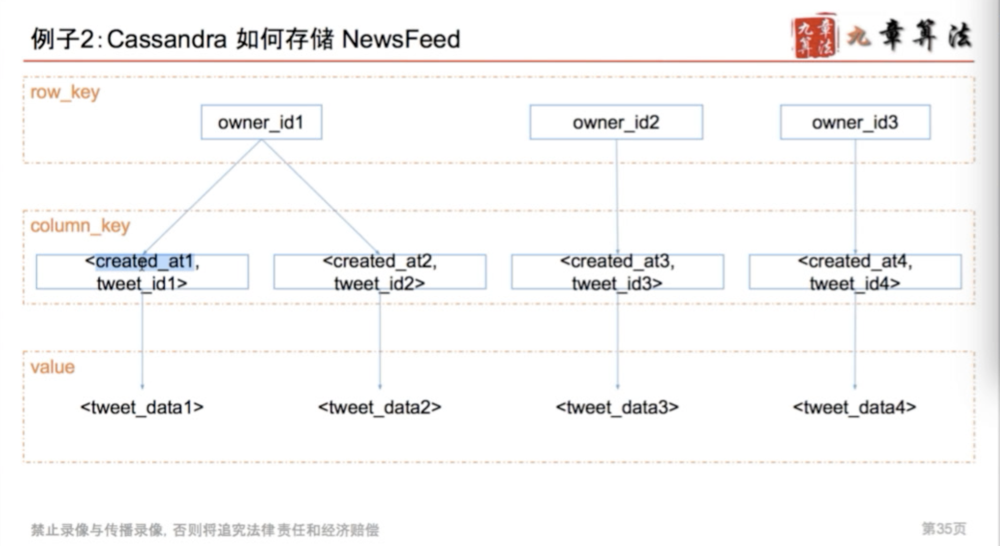

#### Table of Content

# 0. 如何设计系统 How to design the System

### 1. 4S Analysis

- Scenario 场景
  - ask/features/qps/dau/interfaces
  - 需要设计哪些功能
    - step1: enumerate 罗列所有app的功能
      - register/login
      - user profile display / edit
      - upload image / video *
      - search *
      - post / share a tweet
      - timeline / news feed
      - follow / unfollow a user
    - step 2: sort 选出核心功能
      - post a tweet
      - timeline
      - news feed
      - follow / unfollow a user
      - register / login
  - 需要承受多大的访问量？
    - 并发用户concurrent
      - 日活跃*每个用户平均请求次数/一天多少秒user eg. 150M* 60 / 86400 ~ 100k
      - 峰值 peak = average concurrent user * 3 ～ 300 k
      - 快速增长的产品 fast growing
        - max peak users in 3 months = peak users * 2
    - 读频率 read qps(queries per second) eg.300 k
    - 写频率 write qps eg.5k
  - QPS 分析
    - qps = 100: 你用的笔记本做web 服务器就够了
    - qps = 1k： 用一台好点的web服务器，需要考虑single point failure
    - qps = 1m： 需要建设1000台web服务器的集群，考虑如何maintainance
    - 一台web server约承受1k的qps
    - 一台sql database约承受1k的qps
    - 一台nosql database 如cassandra 约承受量是10k的qps
    - 一台nosql database 如memcached 约承受量1m的qps
- Service 服务
  - 大系统如何拆分成小系统
    - step1: replay重放需求
    - step2: merge归并需求
  - split/application/module
- Storage 存储
  - 数据如何存储与访问
    - step 1. select为每个service选择存储结构
    - step 2. schema细化表结构
  - 数据库类型
    - 关系数据库 sql database eg. 用户信息
    - 非关系数据库 nosql database eg.推文 社交图谱
    - 文件系统 file system eg.图片 视频
  - schema/data/sql/nosql/file system
- Scale 升级
  - 解决缺陷，处理可能遇到的问题
  - sharding/optimizing/special case
  - 如何优化系统
    - step1: optimize
      - 解决设计缺陷 solve problems
        - pull vs push， normalize vs de-normalize
      - 更多功能设计 more features
        - edit，delete，media， ads
      - 一些特殊用例 special cases
        - lady gaga，inactive users
    - step2：maintenance
      - 鲁棒性：robust
        - 如果有一台服务器/数据挂了怎么办
      - 扩展性 scalabiliy  
        - 如果有流量暴增，如何扩展

# 1. 新鲜事系统 New Feeds System

- Example:  RSS reader， 朋友圈， twitter， facebook， twitter
- 核心： 关注与被关注，每个人看到的新鲜事都是不同的
- pattern1: storage - Pull Model
  
  - 算法：k merge sorted array： 在用户查看new feeds时，获取每个好友的前100条tweets，合并出前100条news feed
  - 复杂度分析：
    - news feed 假如有n个关注对象，则为n次db reads的时间+k路归并时间（可忽略）
      - 可忽略的原因是 数据库访问的时间比内存计算的时间慢很多（百万倍的差距）
    - post a tweet =》 1次db write的时间
  - 缺陷：
    - n次db reads非常慢
- pattern2: storage - push model
  
  - 算法：
    - 为每个用户建立一个list存储她的news feed信息
    - 用户发一个tweet后，讲该推文逐个推送到每个用户的news feed list中
      - 关键次：fanout
    - 用户需要查看news feed时，只需要从该news feed list中读取最新的100条即可
  - 复杂度分析
    - news feed -》 db read
    - post a tweet -》 n个粉丝，需要n次db write
      - 好处是可以用异步任务在后台执行，无需用户等待
  - 缺陷：
    - 如果follower很多 async fanout的步骤会很慢
  - scale 扩展 - 解决pull的缺陷
    - 最慢的部分发生在用户读请求时（需要耗费用户等待时间）
      - 在db访问之前假如cache
      - cache每个用户的timeline
        - n次db请求 -》 n次cache请求
        - trade off：cache所有的？cache最近的1000条？
      - cache每个用户的news feed
        - 没有cache news feed 的用户，归并n个用户最近的100条tweets，然后取出结果的前100条
        - 有cache news feed 的用户， 归并n个用户的某个时间戳之后的所有tweets
  - scale扩展 - 解决push的缺陷
    - 浪费更多存储空间disk
      - 与pull模型将news feed存在内存中相比
      - push模型将news feed存在disk快多
    - 不活跃用户inactive user
      - 粉丝排序 rank followers by weight
    - 粉丝数目 followers 》》关注数目 following
      - lady gaga的问题： 尝试在现有的模型下做最小的改动来优化，比如多加几台用于做push任务的机器， 并对长期的增长进行估计，并评估是否值得转换整个模型
        - push结合pull的优化方案
          - 普通用户仍然push
          - 将lady gaga这里用户标记为明星用户
          - 对于明星用户，不push到用户的news feed中
          - 当用户需要的时候，来明星用户的timelinie里取，并合并到news feed里
        - 摇摆问题
          - 明星定义： followers > 1m
          - 掉粉：明星用户发tweet之后，依然继续push他们的tweet到所有用户的news feed里， 将关注对象中的明星用户的timeline与自己的news feed进行合并后展示，但并不存储进自己的news feed列表，因为push会负责这个事情
      - 无解？完全切换回pull？
      - trade off：pull + push vs pull

# 2. Design User System

- Scenario 场景
  - 注册，登陆，查询，用户信息修改
    - 查询需求量最大
  - 支持100m DAU
  - 注册，登陆，信息修改qps约
    - 100M * 0.1 / 86400 = 100
    - 0.1 = 平均每个用户每天登陆+注册+信息修改
    - peak = 100 * 3 = 300
  - 查询的qps约
    - 100M * 100 / 86400 ~ 100k
    - 100 = 平均每个用户每天与查询用户
    - peak = 100k * 3 = 300k
- Service 服务
  - 一个authservice 负责登陆注册
  - 一个userservice 负责用户信息存储与查询
  - 一个friendship service负责好友关系存储
- Storage 存储
  - 数据库选择
    - MySQL/Postgres 等sql数据库的性能
      - 约1k qps
    - mongodb/cassandra等硬盘型nosql数据库的性能
      - 约10k qps
    - redis/memcached等内存型nosql数据库的性能（注意数据库的持久化）
      - 100k ～ 1m qps
    - 以上数据根据机器性能和硬盘数量及硬盘读写速度会有区别
    - 注册登陆信息修改300 qps： mysql就能解决
    - 用户信息查询最好用redis类的数据存储系统
    - 用户系统特点：读非常多，写非常少，读多写少的系统，一定要用cache进行优化
      - 爬虫：写多读少
      - 用户用的东西都是读多写少，机器人的东西都是写多读少
  - cache
    - cache是什么？
      - 缓存，把之后可能要查询的东西先存一下
        - 下次要的时候，直接从这里拿，无需重新计算和存取数据库等
      - 可以理解为一个java中的hashmap
      - key-value结构
    - 有哪些常用的cache系统/软件？
      - memcached（不支持数据持久化）
      - redis（支持数据持久化）
    - cache一定是存在内存中么
      - file system也可以做cache
      - cpu也有cache
    - cache一定指server cache么？
      - 不是，frontend/client/browser也可能有客户端的cache
    - cache.delete(key); database/set(user) 几乎不会留下脏数据
    - 读很多就用memcache去做优化

  - Authentication System
    - Session 一般3个月过期
    - 用户login以后
      - 创建一个session 对象
      - 并把session_key作为cookie值传给浏览器
      - 浏览器将该值记录在浏览器的cookie中
      - 用户每次向服务器发送的访问，都会自动带上该网站所有的cookie
      - 此时服务器检测到cookie中的session_key是有效的，就认为用户登陆了
    - 用户logout之后
      - 从session table里删除对应数据
    - session table存在哪儿
      通常都存在数据库，同时用cache去做优化
  - 读写操作都很多：
    - 方法一：使用更多数据库分摊流量
    - 方法二：用redis这样读写操作都很快的cache-through型的database
  - 架构
    - 架构一：cache aside。db和cache之前互不沟通，服务器web server分别与他们沟通，业界典型：memcached+mysql
    - 架构二：服务器只与cache沟通，cache与数据库沟通，业界典型代表redis
  
  - Friendship System
    - 单向好友关系：用户主体(pk)，被关注的人(foriegn key)
    - 双向好友关系：
      - 方案一：存成两条信息
      - 方案二：好友关系存一份 smaller userid， larger userid
    - 好友关系涉及的操作基本都是key-value
    - 大部分公司用的是key value，例如cassadra
    - sql vs nosql 选择标准
      - 大部分都可存
      - 需要支持transaction（必须同时成功同时失败）的话就不能用nosql
      - sql更加成熟，serialization，secondary index等
      - 想要获得更高的性能可以用nosql
    - 以cassandra为例的nosql数据结构
      - 以列为存储，以grid为单位
      - 第一层：row_key（影响它存在哪台机器）
        - 又称hash_key,也是传统所说的key value中的那个key
        - 任何的查询都要带上这个key，无法进行range query
        - 最常用的row_key: user_id
      - 第二层：column_key
        - 是可以进行排序的，可以进行range_query
        - 可以是复合值，比如一个timestamp+user_id的组合
      - 第三层：value
        - 一般来说是string
        - 如果有很多信息，你自己可以做serialization
       
       
- Scale 扩展
  - 考虑上升的qps
  - 单点失效single point failure
    - sharding 数据拆分
      - 按照一定规则，将数据拆分成不同的部分，存在不同的机器上
      - 就算挂了也不会导致网站100%不可用呢
      - sharding(partition) in sql vs nonsql
        - sql自身不带sharding功能，需要码农亲自上手
        - cassandra为例的nosql都自带sharding
      - vertical sharding（比较少）：user table，message table 放不同的数据库
        - 复杂一点：user这种不怎么变的表放在一个数据库，剩下的放一个数据库
        - 也容易发生单点失效
      - horizontal sharding：
        - 如果直接取%10（不一致hash）有什么不好：如果多加一台机器就需要迁移，还很慢
        - 使用一致性hash算法：
          - 不%n机器数目，将key mod一个很大的数，将这个数分配给n个机器，新加一个机器的时候，在表中选择一个位置插入，匀走相邻两个机器的量
          - latency
          - 数据不一致性
    - replica数据备份
      - 通常的做法

# 3. 一致性哈希算法
  - 数据分布不均匀
  - 迁移压力大：新机器的数据只从两台老机器上获取 导致这两台老机器过大
  - 更实用的方法：
    - 将整个hash区间看成环
    - 将环0～359扩展成0～2**64-1
    - 将机器和数据都看作环上的点
    - 引入micro

# 4. 设计短网址系统

# 5. 以gfs分布式文件系统

# 6. 爬虫系统与搜索建议系统

# 7. 分布式计算系统 - map reduce的原理与应用

# 8. 基于地理位置信息的系统设计

# 9. 以big table为例探索分布式数据库

# 10. 聊天系统与访问限制系统
